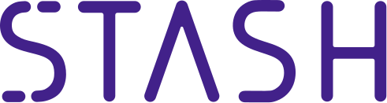
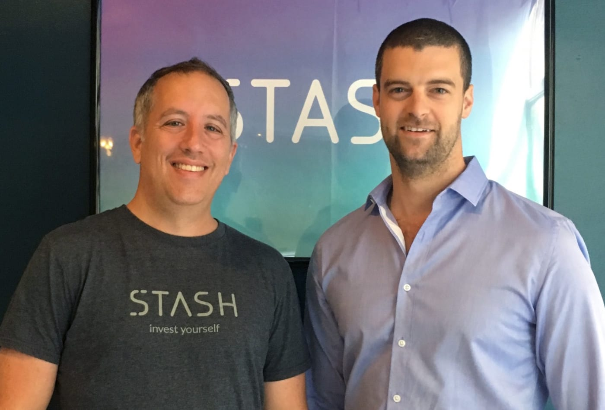

---

## Overview and Origin

### Name
* Stash

### Founded
* February 19, 2015

### Founders

* Brandon Krieg (Left)
* Ed Robinson (Right)

### Founding Ideas
Stash was found to help the average Americans save and invest better. Brandon and Ed were working for a Wall Street startup when one of their colleagues asked "What should I do with my money?". They realized that if a wall-street professional is asking this question, what about the rest of the people, the little guys? They went out in front of their office and start asking questions to the passerby “Do you invest? Would you like to invest? What's holding you back?”. The common answers were "No, I don't invest, but I would like to" and "I don't know how and I don't have enough money". 

Brandon and Ed saw this as a big painful problem, so they resigned from their Wall Street jobs and found a pain pill - Stash.

### Funding
* Funded through Venture Capital. Total $191M+

---

## Business Activities:

Stash was founded to bring investing to the average Americans. Brandon Krieg and Ed Robinson determined that for them to make investing more accessible they would need to remove as many barriers to investment as possible. They decided to create a platform that would provide financial education, advices, guidance and simplicity to consumers with $5 account minimum. Hence, Stash was born.

Stash is aim directly to the average Americans, with little to no savings, little understanding of the financial market, but want to start saving and investing. Stash would provide simplify introduction to investing, and stock selection to educate its customer and help ease the customer to be more comfortable with investing. As such, Stash is hope to help customers build good saving and investing habits for their own future.

The Stash platform is very similar to other micro-investing platforms. Stash stand out through their education and advising services. 

Stash doesn't throw the whole investment book at its customers in classes. The education is delivered in small timely pieces. Stash will first create a personalize stock selection based on customers values to help relate customer to stocks on a personal level. As the customer start looking at stocks and buying stocks, the platform would start introducing various "ideas" such as portfolio diversification, long-term vs. short-term stocks, risk-tolerance, etc. Moreover, the platform would help introduce good investment habits with videogame-like point system - give points for performing good investment habits. These habits will hopefully lead the customer to a wealthier future.

Stash technology uses Big Data, Machine Learning and Deep Learning to learn about its customers to bring most relevant recommendations. Moreover, one of Stash's goals is to help its customers build healthy financial habits. Stash uses its A.I. capability to find the next step which would be least resistive to the customer.

---

## Landscape:

Stash is one of many companies in Micro-Investing space. However, it's more than just Micro-Investing. It also includes Robo-Advisor service by providing stock recommendations. Moreover, Stash also includes Online Banking in their service offerings. 

In recent years, many big traditional brokers and banks start to lower their commission and minimum account requirement to lure in small investors to their services. Moreover, many brokerage houses and banks start to increase their offering to be both investment broker and bank. Everyone starts using Big Data and Robo-Advising in their service offerings. Some also starts to sell Robo-Trading as well. 

As every firms start to offers the same services, Stash still stands out with their focus on building customers' habits. Stash uses their education and game-like recommendation to encourage weekly savings into their investment account. Stash's banking service offer "stock-back", which is the debit card reward program that offer fractional shares of companies when the card is used to purchase that company's product.

Stash's competitors include Robinhood, Acorns, Betterment, and the traditional banks and brokerage firms.

---

## Results

Stash and Micro-Investing applications made investing more easily accessible to people who have never thought that investing was possible for them. The micro-investing companies usually require very low account minimum, some allows 0 minimum, and free trading commission as well. 

Moreover, Stash and many applications also offers Robo-Advisors as part of its basic offering to all customers. By making Robo-Advisors easily accessible to consumers, the micro-investors now have the tools which can help them manage risks and search for investment opportunities, given them services previously thought to be for larger investors only.

Additionally, all of these also has very low management or monthly fees. As these applications become more popular, the traditional brokerages start to lower their account requirements, monthly fees, and commissions as well. 

This focus from bigger firms provides micro-investors with services previously available to larger investors, allowing them the same opportunities that as the larger investors.

Growth for these Micro-Investing applications are the same as any subscription-based business which is number of users. However, as investment firms Asset Under Management (AUM) is also an indication of how the firms perform and retain their customers. Stash and some of its competitors have its metrics below:

|App|Users|AUM|
|---|---|---|
|Stash|4.5 Million|$1.4 Billion|
|Robinhood|4.5 Million|$1.3 Billion|
|Acorns|10 Million|$20 Billion|
|Betterment|500,000|$22 Billion|

Stash is not the best performing in this space. However, it is a niche product that targets average Americans without much financial knowledge and new investors. Its target users would not be bringing large amount of investment to Stash, hence, the low AUM is understandable. Since each customer of Stash bring less asset to invest, Stash's AUM will be lower than applications that offer more comprehensive services than Stash. 

---

## Recommendations

As different firms start offering their services to micro-investors, Stash could also grow by offering more services to customers. Currently, Stash launched their Banking service with Stock-Back, which rewards its customer with fractional shares of company that produces or service purchased. In line with Stash's vision "Opportunity for All", Stash could offer more comprehensive investment vehicles: Insurance, Peer-to-Peer Lending, etc. As Stash customers grows or expand internationally, it could offer crypto-currency as a money transfer method between customers.

Stash could utilize Blockchain and Crypto-currency to build a peer-to-peer lending onto their banking service. It could use A.I. to help match lender's risk profile to borrower's risk profile for efficient links between lender and borrower.

By offer these products and services, Stash could grow into a comprehensive investment house for micro-investors. It can grow to be one-stop service providers for anyone who want to start investing for their future, but doesn't want to jump into big firm. 

---

## Sources

### Websites
* https://stash.com
* https://www.businessinsider.com/stash-brandon-krieg-interview-investing-stock-market-2017-7
* https://www.cnbc.com/2016/10/21/wall-street-vets-left-6-figure-jobs-to-launch-an-app-that-makes-investing-easy.html
* https://www.businessinsider.com/personal-finance/stash-invest-review
* https://venturefizz.com/stories/nyc/inside-engineering-stash
* https://github.com/StashInvest/machine-learning-presentations/blob/master/README.md
* https://www.brokerage-review.com/investing-firm/assets-under-management/acorns-aum.aspx
* https://tearsheet.co/new-banks/stash-opens-the-metrics-kimono-regarding-growth-during-the-pandemic/
* https://www.brokerage-review.com/investing-firm/assets-under-management/robinhood-aum.aspx
* https://www.nerdwallet.com/reviews/investing/advisors/sofi-automated-investing
* https://www.investmentnews.com/betterment-grows-500k-accounts-189575

### Podcasts 
* StashInvest - Teach Me How to Money - Why I started Stash with Brandon Krieg
* Wharton FinTech Podcast - Brandon Krieg - Founder of Stash
* Chain of Wealth - Brandon Krieg on Micro Investing, The Stock Market and more!
