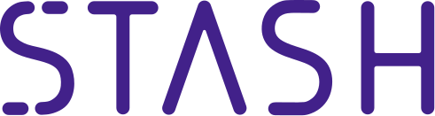

# Stash

## Overview and Origin

### Name
* Stash

### Founded
* February 19, 2015

### Founders

* Brandon Krieg (Left)
* Ed Robinson (Right)

### Founding Ideas
Stash was found to help the average Americans save and invest better. Brandon and Ed were working for a Wall Street startup when one of their colleages asked "What should I do with my money?". They realized that if a wall-street professional is asking this question, what about the rest of the people, the little guys? They went out in front of their office and start asking questions to the passerby. Do you invest?; Would you like to invest?; What's holding you back? The common answers were "No, I don't invest, but I would like to" and "I don't know how and I don't have enough money". 

Brandon and Ed saw this as a big painful problems, so they resigned from their Wall Street jobs and found a pain pill - Stash.

### Funding
* Funded through Venture Capital. Total $191M+

---

## Business Activities:

* What specific financial problem is the company or project trying to solve?

* Who is the company's intended customer?  Is there any information about the market size of this set of customers?
What solution does this company offer that their competitors do not or cannot offer? (What is the unfair advantage they utilize?)

* Which technologies are they currently using, and how are they implementing them? (This may take a little bit of sleuthing–– you may want to search the company’s engineering blog or use sites like Stackshare to find this information.)

Stash was founded to bring investing to the average Americans. Brandon Krieg and Ed Robinson determined that for them to make investing more accessible they would need to remove as many barriers to investment as possible. They decided to create a platform that would provides financial education, advices, guidance and simplicity to consumers with $5 account minimum. Hence, Stash was born.

Stash is aim directly to the average Americans, with little to no savings, little understanding of the financial market, but want to start saving and investing. Stash would provides simplify introduction to investing, and stock selection to educate its customer and help ease the customer to be more comfortable with investing. As such, Stash is hope to help customers build good saving and investing habits for their own future.

The Stash platform is very similar to other micro-investing platforms. Stash stand out through their education and advising services. 

Stash doesn't throw the whole investment book at its customers in classes. The education is deliver in small timely pieces. Stash will first create a personalize stock selection based on customers values to help relate customer to stocks on a personal level. As the customer start looking at stocks and buying stocks, the platform would start introducing various "ideas" such as portfolio diversification, long-term vs. short-term stocks, risk-tolerance, etc. Moreover, the platform would help introduce good investment habits with videogame-like point system - give points for performing good investment habits. These habits will hopefully led the customer to a more wealthy future.

Stash technology - Engineering?

---

## Landscape:

* What domain of the financial industry is the company in?
* Asset Management / Robo-Advising / Personal Finance / Micro-Investing

* What have been the major trends and innovations of this domain over the last 5-10 years?
* Combining and Personalization of Investments, Advising, Banking
* Everything is done instantaneously
* Bigdata in analysis

* What are the other major companies in this domain?
* Robinhood, Acorns, Webull
* WealthFront, Traditional Banks and Brokerage Firms

---

## Results

* What has been the business impact of this company so far?
* More people start investing, increase competition on investment
* Big traditional firms starts offering 0 comissions and automatic/schedule savings with automatic investings

* What are some of the core metrics that companies in this domain use to measure success? How is your company performing, based on these metrics?
* Mostly # of accounts and $$$ under management

* How is your company performing relative to competitors in the same domain?

## Recommendations

* If you were to advise the company, what products or services would you suggest they offer? (This could be something that a competitor offers, or use your imagination!)
* Now offer Banking, possibly life insurance services/Crypto, peer-to-peer lending

* Why do you think that offering this product or service would benefit the company?
* Provide more comprehensive wealth planning/management

* What technologies would this additional product or service utilize?
* Micro Loans - BlockChain
* InsurTech

* Why are these technologies appropriate for your solution?
* Can be build on top of current technology

---

## Addendum

## Sources
### Websites
* https://stash.com
* https://www.businessinsider.com/stash-brandon-krieg-interview-investing-stock-market-2017-7
* https://www.cnbc.com/2016/10/21/wall-street-vets-left-6-figure-jobs-to-launch-an-app-that-makes-investing-easy.html
* https://www.businessinsider.com/personal-finance/stash-invest-review
* 
### Podcasts 
* Stash - Teach Me How To Money - Why I started Stash with Brandon Krieg
* Wharton FinTech Podcast - BRandon Krieg - Founder of Stash
* Chain of Wealth - Brandon Krieg on Micro Investing, The Stock Market and more!
